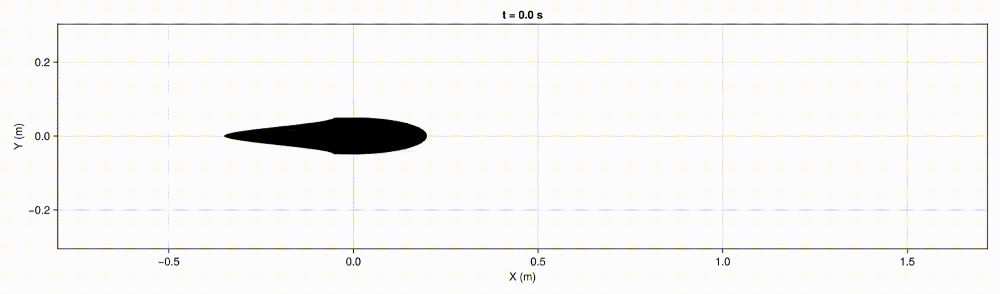
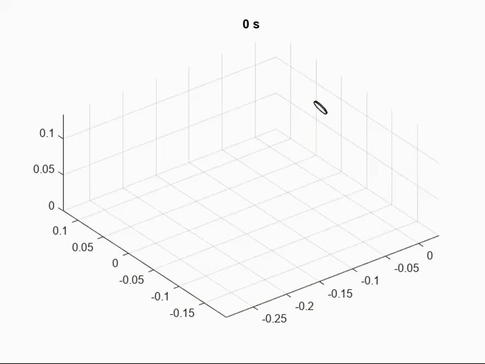
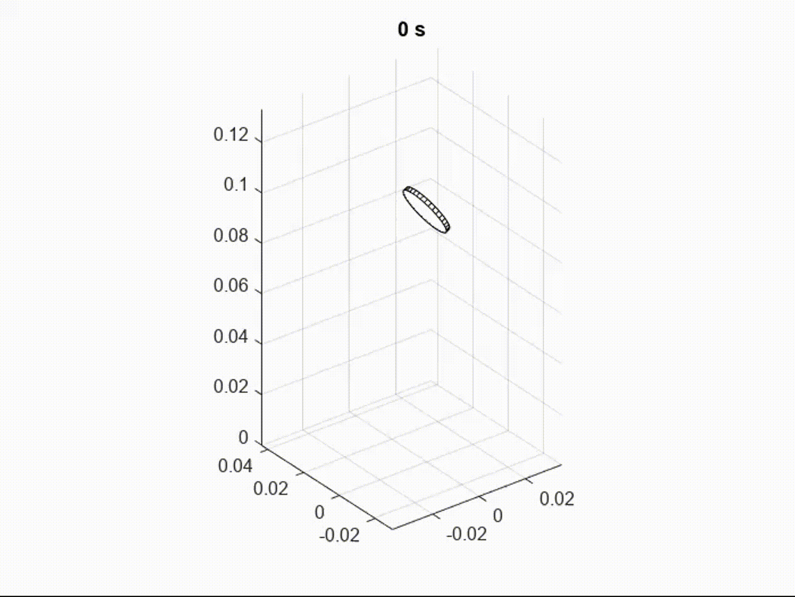
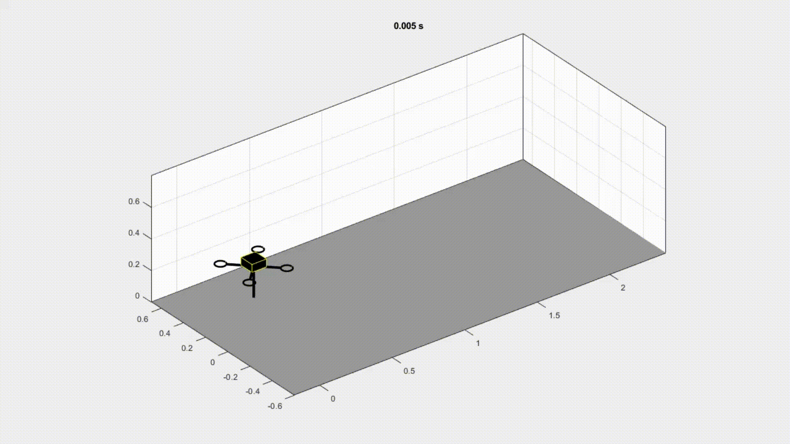
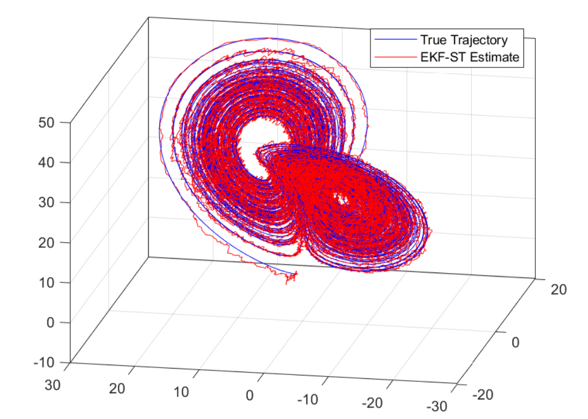

  <!-- hovering avatar and navigation -->
  

    
    

      <a href="#about" style="display: block; margin: 0.5rem 0;"> About </a>
      <a href="#publications" style="display: block; margin: 0.5rem 0;"> Publications </a>
      <a href="#research-overview" style="display: block; margin: 0.5rem 0;"> Research Overview </a>
      <a href="#project-demos" style="display: block; margin: 0.5rem 0;"> Project Demos </a>
      <a href="#moments" style="display: block; margin: 0.5rem 0;"> Moments </a>
    

  

  <!-- start of main contents -->
  

## Zhiheng Chen {#about}
📍 Ithaca, NY  
📧 Email: zc548@cornell.edu | ericczh1@outlook.com  
🔗 [CV](./assets/CV.pdf) | [Google Scholar](https://scholar.google.com/citations?hl=en&user=P07pyI0AAAAJ&sortby=pubdate&view_op=list_works&gmla=AH8HC4w-r-FrGec2ZXnlCZq1bFQbYdELeyPaTtNHRWEObM7CbUKhBYTyIp_VOG55eYldkJ8sdH8sJzHZ5R-6brxU) | [GitHub](https://github.com/Zhiheng-Chen?tab=repositories)

Hello! I'm a Master of Science student in the [Sibley School of Mechanical and Aerospace Engineering](https://www.engineering.cornell.edu/mae/) at Cornell University. 

---

## Publications {#publications}
[1] **Z. Chen** and W. Wang. *Modeling Elastic-Body Dynamics of Fish Swimming Using a Variational Framework*. IEEE Robotics and Automation Letters (RA-L, under review). [ar$\Chi$iv preprint](https://arxiv.org/abs/2509.16145).

[2] **Z. Chen** and W. Wang. *Dynamic Modeling and Efficient Data-Driven Optimal Control for Micro Autonomous Surface Vehicles*. 2025 IEEE/RSJ International Conference on Intelligent Robots and Systems (IROS 2025). [ar$\Chi$iv preprint](https://arxiv.org/abs/2509.06882).

[3] K. Macauley, **Z. Chen**, and W. Wang. *MicroASV: An Affordable 3D-Printed Centimeter-Scale Autonomous Surface Vehicle*. 2025 IEEE International Conference of Robotics and Automation (ICRA 2025). [Paper link](https://ieeexplore.ieee.org/document/11127526).

[4] Y. Wang, J. Kang, **Z. Chen**, and X. Xiong. *Terrestrial Locomotion of PogoX: From Hardware Design to Energy Shaping and Step-to-step Dynamics Based Control*. 2024 IEEE International Conference of Robotics and Automation (ICRA 2024, co-first author). [Paper link](https://ieeexplore.ieee.org/document/10611545).

---

## Research Overview {#research-overview}
Throughout my undergraduate and master’s studies, I have centered my research and academic focus on the modeling and control of dynamical systems.

Around this core, I developed a robust toolkit - ranging from dynamics, optimal control, and recursive estimation to numerical analysis and data-driven system identification - not as independent pursuits, but as necessary and interdependent tools to analyze, estimate, and shape the behavior of complex physical systems.

Specifically, my research interests include:

#### Analytical Dynamics Modeling
I am interested in the analysis on the kinematics and kinetics of dynamical systems based on mechanics principles.
- In my undergraduate research (summer 2023), I worked on the 3D hybrid dynamics modeling and numerical simulations of a [legged hopping robot](https://ieeexplore.ieee.org/abstract/document/10611545). 
- As a self-driven project, I also modeled and simulated the 3D dynamics of a [wobbling coin rolling along the ground](https://github.com/Zhiheng-Chen/3D-Rolling-Disk-Dynamics-Simulation) (winter 2023). 
- In summer and fall 2024, I worked in the [Marine Robotics Laboratory](https://mrl.engr.wisc.edu/) on the dynamics modeling and simulations of a micro autonomous surface vehicle (MicroASV). 
- One of my current research projects is the dynamics modeling of a flexible robotic fish based on Hamilton's principle. The dynamics involve the sophisticated and interesting interactions among rigid bodies, elastic bodies, and fluids. I have coded up a working simulator of the robotic fish in Julia, and I am currently working on parameter and design optimizations based on the simulation results.

#### Data-Driven Modeling
In addition to analytical modeling, I am also fascinated by system identifications and equation learning for dynamical systems. 
- My research project at Cornell University on the weak formulation of the Sparse Identification of Nonlinear Dynamics (SINDy) is supervised by Professor [Anastasia Bizyaeva](https://www.engineering.cornell.edu/people/anastasia-bizyaeva/). We are working towards improving the test functions of the weak-form SINDy to boost the interpretability, efficiency, and noise-robustness of the algorithm. 
- In the MicroASV project, I also designed a weak formulation-based parameter estimation algorithm to iteratively refine the dynamics model. 
- In Spring 2025, I designed the [EKF-ST](https://github.com/Zhiheng-Chen/EKF-ST) algorithm that combines the extended Kalman filter and sequential thresholding techniques. The algorithm enables recursive and simultaneous state estimations and equation learning.

#### Nonlinear Dynamics and Control
I am interested in the analysis and control of dynamical system based on the resulting models.
- I study fixed points, limit cycles, chaotic attractors, and bifurcations of nonlinear dynamical systems.
- In the legged hopping robot project, I designed aerial phase PD controllers to adjust the foot placement.
- In the MicroASV project, I designed LQR and variational principle-based (nonlinear) controllers for the robot, enabling it to accurately perform trajectory tracking tasks.

---

## Project Demos {#project-demos}
I am happy to share the demos of some of my projects mentioned in my research overview.

#### Rigid-Soft-Fluid Coupling Dynamics of a Robotic Fish 
This is a project I am currently working on. I model the fish as a rigid head and an elastic body connected by a motor-driven revolute joint. I use Hamilton's principle, [elastica theory](https://en.wikipedia.org/wiki/Elastica_theory), [Lighthill's elongated body theory](https://royalsocietypublishing.org/doi/10.1098/rspb.1971.0085), and Ritz series approximations to obtain the projected weak form of the equations of motion. Then I code up the numerical simulations in [Julia](https://julialang.org/):

    

#### 3D Contact Dynamics of a Rolling Disk
This was a self-driven project when I was an undergraduate student at UW-Madison. I modeled the 3D dynamics of the disk (size of a coin) using Lagrange's equations with 6 generalized coordinates. In the rolling phase, the equations of motion are solved in parallel with 3 constraint equations (2 nonholonomic constraints for roll without slip, and 1 holonomic constraint for the height of the contact point). I implememnted the [numerical simulations of the disk](https://github.com/Zhiheng-Chen/3D-Rolling-Disk-Dynamics-Simulation) in MATLAB:

    
    

#### Hybrid Dynamics of a Legged Hopping Robot
In my undergraduate research, I was responsible for the 3D hybrid dynamics modeling and numerical simulations of a single-legged hopping robot named [PogoX](https://ieeexplore.ieee.org/document/10611545). I modeled PogoX as 2 rigid bodies connected by a prismatic joint. The hybrid dynamics model consists of the aerial phase, the impact mapping, and the stance phase, assuming a smooth transition from the stance phase to the aerial phase. I coded up the numerical simulations in MATLAB:

    

#### EKF-ST for Simultaneous State Estimation and Equation Learning
This is an individual course project from my Model-Based Estimation course at Cornell University. I devised the [EKF-ST](https://github.com/Zhiheng-Chen/EKF-ST) algorithm (extended Kalman filter with sequential thresholding). The algorithm enables simultaneous and recursively refined state estimations and sparse system identifications for nonlinear dynamical systems. EKF-ST adds a thresholding process to the original EKF prediction-update loops to prune the spurious basis functions and the corresponding covariances.

<figure style="text-align: left">
  
  <figcaption style="font-size: 0.9rem; color: #000000ff;">EKF-ST estimation for the Lorenz system with process and observation noise, an unknown governing equation, and partial state observations.</figcaption>
</figure>

---

## Moments {#moments}
Outside of research, I enjoy swimming, practicing boxing, and (occasionally) rowing. I’m also passionate about rope-skipping — during an international competition, I placed 11th worldwide in the triple-under grand final and 7th nationally in the double-under final!

Here are a few videos from my training and competition moments:
- [25-meter butterfly stroke](assets/Butterfly.mp4)
- [Triple-under rope-skipping grand final](assets/RopeSkipping-TrippleUnder.mp4)
- [Double-under rope-skipping practice](assets/RopeSkipping-DoubleUnder.mp4)
- [Boxing drills with my coach: distance control, feints, and counter-punching](assets/Boxing.mp4)
- [Sync or swim — sculling drills with my teammate](assets/Rowing.mp4). We eventually took home a [bronze medal](assets/RowingMedal.jpg)!